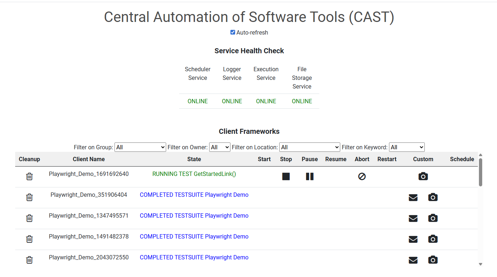

[](https://www.gnu.org/licenses/old-licenses/gpl-2.0.en.html)
* [](https://github.com/ksnyder2452/cast/actions/workflows/client_service.yml)
* [](https://github.com/ksnyder2452/cast/actions/workflows/execution_service.yml)
* [](https://github.com/ksnyder2452/cast/actions/workflows/file_storage_service.yml)
* [](https://github.com/ksnyder2452/cast/actions/workflows/health_service.yml)
* [](https://github.com/ksnyder2452/cast/actions/workflows/logger_service.yml)
* [](https://github.com/ksnyder2452/cast/actions/workflows/scheduler_service.yml)
* [](https://github.com/ksnyder2452/cast/actions/workflows/execution_ui.yml)

# Authors
* Kevin Snyder
* Michael Wu

# Introduction 
The Centralized Automation of Software Tools Framework (CAST) is intended to provide standard, central actions around locally-defined applications (such as DiY Test Frameworks). The following core functionalities are supported

* Remote control of client actions
* Remote storage and distribution of files
* Integration with REST APIs




This provides several key benefits

* Centralized control of all associated applications
* Centralized storage of reporting data (for use in dashboards)
* Simple integration into Pipelines
* The ability to add new Services into registered applications with minimal application changes
* The ability to compare and contrast application data across time, across clients and across platforms
* The opportunity to integrate with newly-developed applications and with existing applications (with minimal changes to existing functionality)
* The opportunity to provide alternative control mechanisms and reporting functionality for existing applications

# Getting Started
* Software dependencies
   * [RabbitMQ Server](https://www.rabbitmq.com/)
   * [MySQL Server](https://www.mysql.com/)
   * [DotNet 9.0](https://dotnet.microsoft.com/en-us/download/dotnet/9.0)
   * [openjdk-25](https://openjdk.org/projects/jdk/25/)
   * [Font Awesome](https://fontawesome.com/v4/icons/)
   * [DHTML Calendar](https://dhtmlx.com/docs/products/dhtmlxCalendar/download.shtml#download-standard)

# Components
* MySQL database instance
* RabbitMQ Server
* Logger Service. Used to push information to the mysql database
* File Storage Service. Used to queue outbound files and receive inbound files
* Execution Service. Used to handle all communications between the CAST Service and registered applications. Both Messages and Files are sent via the Execution Service
* Scheduler Service. Schedule the Start Action for registered applications
* Health Check Service. Used to check the state of all Services (including registered applications) and update the database appropriately
* UI Controller. Used to manually control all registered applications, but also to demonstrate/simulate CAST functionality
* REST Listener. Used to push Actions to registered applications via REST API calls
* Playwright Demo. Modification of the Playwright Tutorial to include hooks into the CAST framework that functions as a registered demo. See [Playwright .Net demo](https://playwright.dev/dotnet/docs/intro) for the original source code
* Playwright Java Demo. Modification of the Playwright Tutorial to include hooks into the CAST framework that functions are a registered demo. See [Playwright Java demo](https://playwright.dev/java/docs/api/) for the original source code
* Helper Apps. Used to help setup and configure a CAST environment

# Folder structure
```
├── LICENSE
├── README.md
├── CONTRIBUTING.md
├── CODE_OF_CONDUCT.md
├── QuickStartGuide.txt              # Setup a sample Server instance from scratch
├── Server_DoxyFile                  # Generate CAST Server API documentation
├── CAST_Client_Service              # CAST .Net Client
│   └── CAST_Client_Service
├── CAST_Java_Client_Service         # CAST Java Client
│   └── src
│       ├── META_INF
│       └── cast
├── CAST_Rest_Listener               # REST API Execution Service Listener
│   ├── Pages
│   │   └── Shared
│   ├── Properties
│   └── wwwroot
│       ├── css
│       ├── js
│       └── lib
├── Execution_Service                # CAST Execution Service
├── Execution_UI                     # CAST Execution Controller UI
│   └── Execution_UI
│       ├── Pages
│       │   └── Shared
│       ├── Properties
│       ├── clients                  # Latest client DLL download
│       │   └── 1.0.0                # v1.0.0 client DLL download
│       └── wwwroot
│           ├── client               # API Documentation
│           ├── clients              # Latest client JAR download
│           │   └── 1.0.0            # v1.0.0 client JAR download
│           ├── css
│           ├── diagrams             # CAST diagrams
│           ├── js
│           ├── lib
│           ├── server               # Server documentation
│           └── suite_gpl            # DHTMLX Calendar codebase
├── File_Storage_Service             # CAST File Storage Service
├── Health Service                   # CAST Health Service
├── Helpers                          # Helper tools for setup/configuration of the CAST Server
│   ├── Setup_Server_Config_Files    # Copy preconfigured config files from a single location to all endpoints
│   │   └── originals                # Preconfigured versions of all config files
│   ├── screenshots
│   └── diagrams
├── Logger_Service                   # Primary Service of CAST communications
├── Playwright_Demo                  # .Net (client) CAST demo
│   └── References
├── Playwright_Java_Demo             # Java (client) CAST demo
│       ├── lib
│       ├── resources
│       └── src
│           └── main
│               └── java
└── Scheduler_Service                # CAST Scheduling Service
```

# Configure and run the CAST Server (on a hosted environment)
* Install a MySQL Server instance
   * Create a database called cast_server with a remote-accessible account named cast_admin as well as the following accounts
     * create user 'cast_read'@'...' identified by '...';
	  * create user 'cast_write'@'...' identified by '...';
	  * grant SELECT on cast_server.* to 'cast_read'@'...';
     * grant INSERT, UPDATE, DELETE, SELECT on cast_server.* to 'cast_write'@'...';
        * SELECT is required to support UPDATE
   * Create the following [table definitions](./Helpers/setup_tables.sql)
* Install a RabbitMQ Server
   * Configure the [RabbitMQ Server](./Helpers/rabbimq_setup.txt)
* Configure all CAST (Server) services and components
   * Automatically configure all files (locally)
     * cd ./Helpers/Setup_Server_Config_Files/
     * Update all files under ./originals/
     * dotnet run
     * Update your application properties file
        * cast.properties for .Net/
        * resources/config.properties for Java
   * or manually configure all files
     * ./Logger_Service/app.config
     * ./File_Storage_Service/app.config
     * ./Execution_Service/app.config
     * ./Scheduler_Service/app.config
     * ./Health_Service/app.config
     * ./CAST_Rest_Listener/appsettings.json
     * ./Execution_UI/Execution_UI/appsettings.json
     * ./Application root/cast.properties (.Net)
     * ./Application root/resources/config.properties (Java)
* Launch the RabbitMQ Server
* Launch the MySQL Server
* Launch the Logger Service
   * cd ./Logger_Service/
   * dotnet clean
   * dotnet run
* Launch the File Storage Service
   * cd ./File_Storage_Service/
   * dotnet clean
   * dotnet run
* Launch the Execution Service
   * cd ./Execution_Service
   * dotnet clean
   * dotnet run
* Launch the Scheduler Service
   * cd ./Scheduler_Service
   * dotnet clean
   * dotnet run
* Launch the Health Check Service
   * cd ./Health_Service
   * dotnet clean
   * dotnet run
* Launch the UI Controller
   * cd ./Execution_UI/Execution_UI/
   * dotnet clean
   * dotnet run
* Launch your remote application instance
* Connect to http://CAST_Server_IP/ and start manipulating your (registered) remote applications
   * the Execution UI (and all documentation and links) are available from the index page
   * You can go directly to the Execution UI using http://CAST_Server_IP/cast

# Recommended Startup and Shutdown order (assuming all Services will be running)
* Startup
  * Logger Service. This Service should always be launched first
  * Execution Service
  * File Storage Service
  * Scheduler Service
  * Health Check Service
  * Execution UI/REST Listener
  * Clients
* Shutdown
  * Clients
  * Execution UI/REST Listener
  * Scheduler Service
  * File Storage Service
  * Execution Service
  * Logger Service. This Service should always be shutdown second-to-last
  * Health Check Service. This Service should always be shutdown last

# How to register (and interact with) your .Net application
* **See ./Playwright_Demo/UnitTest1.cs for an example**
* Set cast.properties to the correct values
* Add a reference to CAST_Client_Service.dll
* Call CAST_Client_Service.CAST_Client_Service.updateFrameworkFunctionality() at the beginning of your application to register it
   * updateFrameworkFunctionality() is required
* Call CAST_Client_Service.CAST_Client_Service.updateState("ONLINE") to tell CAST that your application is online.
   * The Execution UI keys on a state that starts with 'ONLINE', and therefore ONLINE is required and reserved
* Call CAST_Client_Service.CAST_Client_Service.updateState("READY", "green") to tell CAST that your application is ready to start
   * The Execution UI keys on a state that starts with 'READY', and therefore READY* is required and reserved
* Call CAST_Client_Service.CAST_Client_Service.updateState("COMPLETED", "green") to tell CAST that your application is finished
   * The Execution UI keys on a state that starts with 'COMPLETED', and therefore COMPLETED* is required and reserved
* Call CAST_Client_Service.CAST_Client_Service.updateResult() to update your application results on the CAST database. This can be used for reporting
* Call CAST_Client_Service.CAST_Client_Service.updateState() to tell CAST the state of your application. This will impact the available Actions on the UI
* Call CAST_Client_Service.CAST_Client_Service.registerAction() to create custom Actions for your application
* Call CAST_Client_Service.CAST_Client_Service.uploadOutputFolder() to upload the contents of the output folder to the File Storage Service
* Call CAST_Client_Service.CAST_Client_Service.closeQueue() to close the Message Queue once your application run is complete
* Check for CAST Action state by retrieving CAST_Client_Service.CAST_Client_Service._* (boolean)
* Retrieve your application UUID by retrieving CAST_Client_Service.CAST_Client_Service.startmyuuidAsString

# How to register (and interact with) your Java application
* **See ./Playwright_Java_Demo/src/main/java/CAST_Demo.java for an example**
* Set ./resources/config.properties to the correct values
* Add the library CAST_Java_Client_Service.jar
* import main.java.cast.Java_Client_Service;
* Call Java_Client_Service.updateFrameworkFunctionality() at the beginning of your application to register it
   * updateFrameworkFunctionality() is required
* Call Java_Client_Service.updateState("ONLINE", "black") to tell CAST that your application is online
   * The Execution UI keys on a state that starts with 'ONLINE', and therefore ONLINE is required and reserved
* Call Java_Client_Service.updateState("READY", "green") to tell CAST that your application is ready to start
   * The Execution UI keys on a state that starts with 'READY', and therefore READY* is required and reserved
* Call Java_Client_Service.updateState("COMPLETED", "green") to tell CAST that your application is is finished
   * The Execution UI keys on a state that starts with 'COMPLETED', and therefore COMPLETED* is required and reserved
* Call Java_Client_Service.updateResult() to update your application results on the CAST database. This can be used for reporting
* Call Java_Client_Service.updateState() to tell CAST the state of your application. This will impact the available Actions on the UI
* Call Java_Client_Service.registerAction() to create custom Actions for your application
* Call Java_Client_Service.uploadResultFolder() to uplaod the contents of the output folder to the File Storage Service
* Check for CAST Action state by retrieving Java_Client_Service._* (boolean)
* Retrieve your application UUID by retrieving Java_Client_Service.uuidAsString
  
# Running the .Net Test Framework Demo
* Setup Playwright Browsers
   * (.Net) .\bin\debug\net8.0\playwright.ps1 install
* Launch the Test Framework
   * cd ./Playwright_Demo/
   * Configure the cast.properties file
     * Note that client_service.dll is included in /Playwright_Demo/References/. A new version can be compiled from ./CAST_Client_Service/
   * Run the test suite using 'dotnet test'
* Open the Execution UI page (http://CAST_Server_IP/cast)
* Select the top framework instance
* Start the Test Run
* Test the various Actions and Simulate a complete test run
* Verify the Demo completed as expected (assuming the Demo is not Aborted or Stopped prematurely)
   * The Execution UI will list the state 'COMPLETED TESTSUITE Playwright Demo'
   * Check that no Errors are displayed within the Logger Service console
   * Check that the File Storage Service received the result file
   * The result file current_results.csv is available in .\File_Storage_Service\temp\inbound_queue\client_service_*\

# Running the Java Test Framework Demo
* Setup Playwright Browsers
   * [Java Playwright.create()](https://playwright.dev/java/docs/intro)
* Launch the Test Framework
   * cd ./Playwright_Java_Demo/
   * Configure the ./resources/config.properties file
     * Note that CAST_Java_Client_Service.jar is included in /Playwright_Java_Demo/lib/. A new version can be compiled from ./CAST_Java_Client_Service/
   * Run the test suite from your favorite tool. We used Intellij Community Edition
* Open the Execution UI page (http://CAST_Server_IP/cast)
* Select the top framework instance
* Start the Test Run
* Test the various Actions and Simulate a complete test run
* Verify the Demo completed as expected (assuming the Demo is not Aborted or Stopped prematurely)
   * The Execution UI will list the state 'COMPLETED TESTSUITE Playwright Java Demo'
   * Check that no Errors are displayed within the Logger Service console
   * Check that the File Storage Service received the result file
   * The result file current_results.csv is available in .\File_Storage_Service\temp\inbound_queue\client_service_*\

# Notes
* Every Client uses it's own unique Message Queue
   * Every Client should use it's own RabbitMQ Account. See [rabbimq_setup.txt](./Helpers/rabbimq_setup.txt) for recommended Client configurations
   * The Message Queue is created upon loading CAST_client_service.dll or CAST_Java_Client_Service.jar
* For Dashboard analysis
   * All CAST details are stored within the table logger
      * reference_uuid can be thought of as a Session UUID. Which gives us the ability to easily filter all logs and events to a single reference
      * originator is the UUID of the Service that created the record
      * display_name is used to map UUID to an easily understood reference
      * event_time_dt is the date/timestamp (excluding timezone)
      * order_in_system is the Primary Key
   * Client State data is stored within the table state
   * Final Results data is stored within the table results
* Every .Net Client must include a cast.properties in the root folder. See /Playwright_Demo/cast.properties as an example
* Every Java Client must include a config.properties in the ./resources/ folder. See /Playwright_Java_Demo/resources/config.properties as an example
* Health Check will automatically delete old Queues if the RabbitMQ Controller exists on the same machine (under c:\program files\Rabbitmq Server\)
* The File Storage Service is currently configured to receive inbound files from the frameworks
   * See /Playwright_Demo/UnitTest.cs and /Playwright_Java_Demo/src/main/java/CAST_Demo.java for an example (test results are sent to the File Storage Service)
   * Outbound sends (to Clients) have not been implemented yet
   * Inbound files will be saved in \File_Storage_Service\temp\inbound_queue\client_service_UUID\
   * Client folders will be Zipped prior to sending
* Both Scheduler Service and the Health Service can take a few seconds to shutdown properly. Please be patient
* The API call updateFrameworkFunctionality() will register your application instance with the CAST Server. Once this call occurs you will see the instance on the Execution UI and will be able to reference it through our REST Listener


